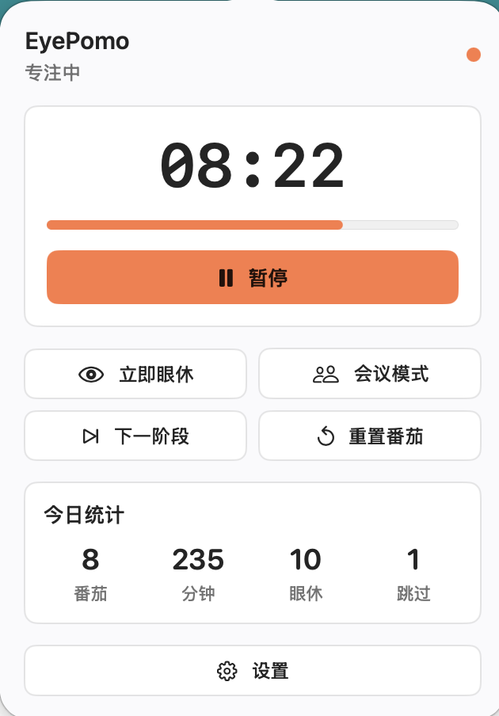
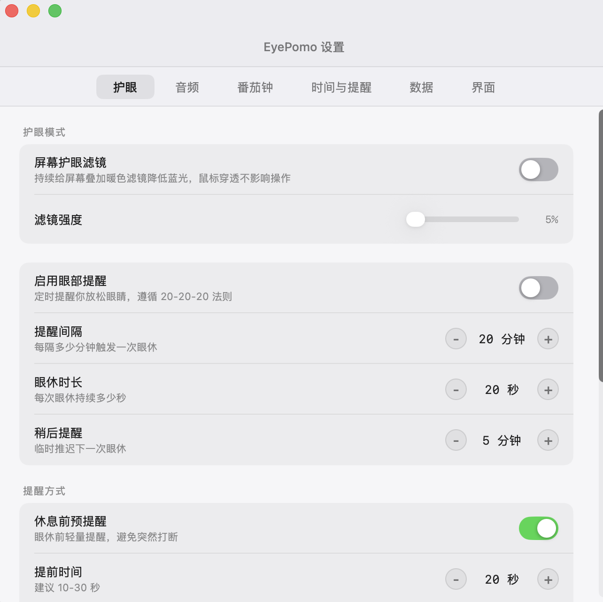
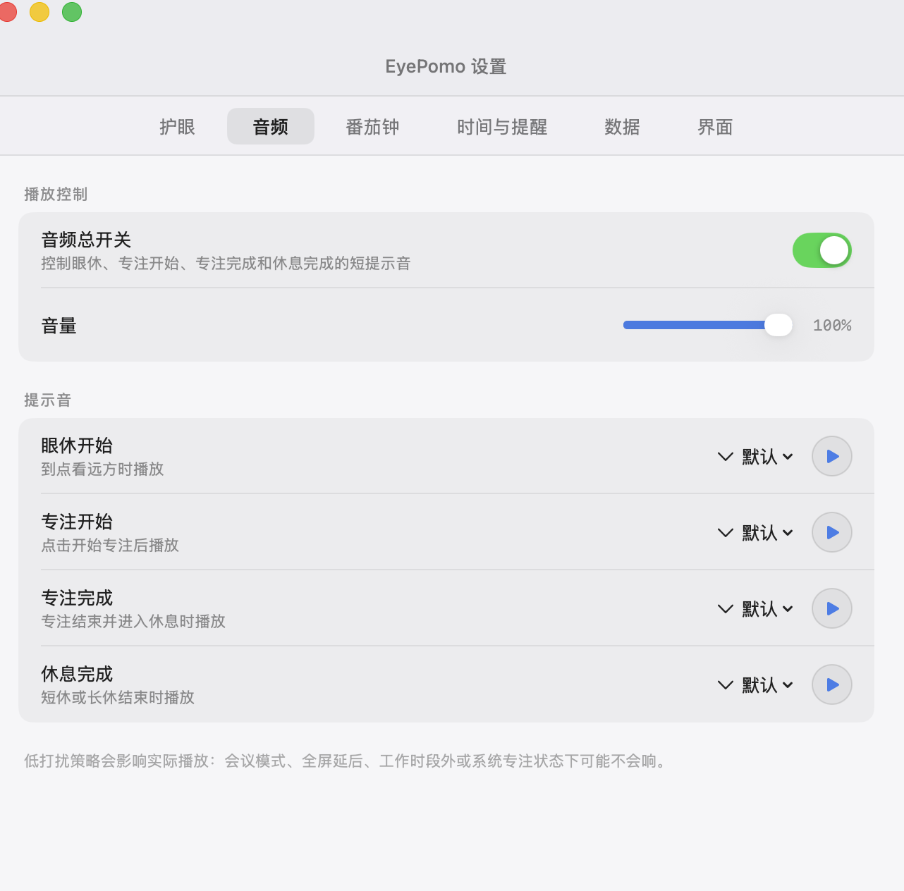
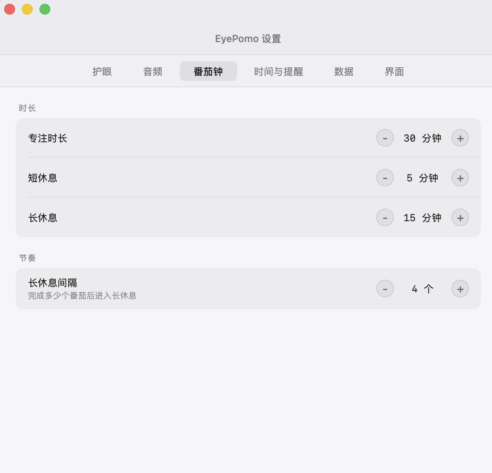
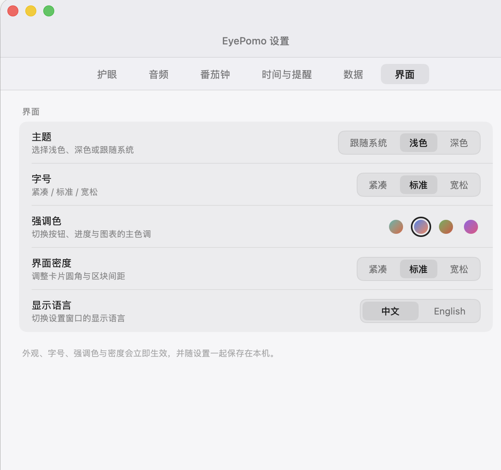
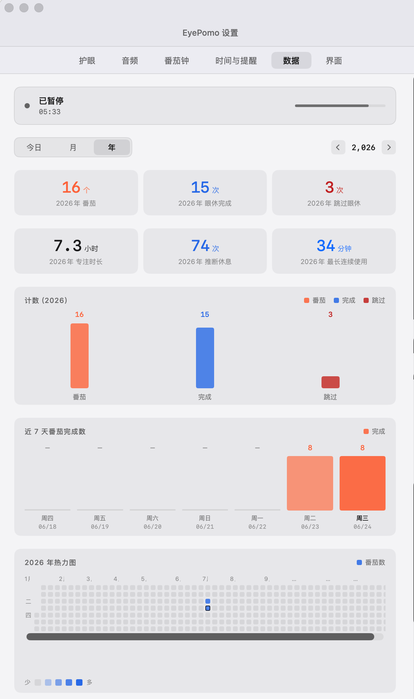

# EyePomo

EyePomo 是一个 macOS 13+ 菜单栏应用，目标很窄：提醒长时间盯屏的人按 20-20-20 规则休息眼睛，同时提供一套轻量番茄钟。

它常驻菜单栏，不需要账号，也不依赖云服务。专注、眼休、跳过、稍后、空闲推测休息这些行为会写入本地 JSONL 日志，再派生出每日统计和 Markdown 月度记录，方便之后用本地 AI 或普通文本工具回看自己的使用节奏。

做 EyePomo 不是为了重复造一个番茄钟或护眼提醒轮子。试过一圈现有工具后，我发现它们要么功能太重，要么一些功能细节没法满足我的使用要求。于是我花了几个小时用 Codex 写出初版，又继续花了几个小时打磨体验细节。现在它保持得很小，但日常使用已经比较简单好用。

## 界面预览

<p align="center">
  
</p>

| 护眼设置 | 音频设置 |
| --- | --- |
|  |  |

| 番茄钟设置 | 界面设置 |
| --- | --- |
|  |  |

<p align="center">
  
</p>

## 功能状态

已经落地的部分：

- 菜单栏常驻：使用 `NSStatusItem + NSPopover`，App 默认以 accessory 模式运行，不占 Dock。
- 20-20-20 眼休：默认每 20 分钟提醒一次，每次 20 秒，支持完成、稍后 5 分钟和跳过。
- 番茄钟：默认 25 分钟专注、5 分钟短休、15 分钟长休，每完成 4 个专注阶段进入长休。
- 打扰合并：眼休临近番茄休息时会推迟，避免短时间内连续弹提醒。
- 空闲与系统事件：支持 idle、睡眠、唤醒、锁屏、解锁等状态输入。
- 工作时段：默认 9:00 到 18:00 内启用提醒，可在偏好设置中调整。
- 本地统计：今日统计、近期趋势、年度热力图、月度 Markdown 记录和 JSON 摘要缓存。
- 本地数据：事件日志、摘要、状态恢复文件都放在用户本机。
- 护眼滤镜：可选暖色半透明覆盖层，按屏幕数量创建 AppKit 面板。
- 提示音资源：内置 9 个短提示音，来源见 `EyePomoApp/Resources/Sounds/THIRD_PARTY_AUDIO.md`。

暂时不做的部分：

- 账号、云同步、团队协作、订阅支付。
- 待办事项、项目管理、日历同步。
- App 或网站屏蔽、应用追踪、截图、剪贴板历史。
- Apple Watch / iOS 同步。

## 项目结构

```text
.
├── EyePomo.xcodeproj
├── EyePomoApp
│   ├── App
│   ├── Features
│   │   ├── MenuBar
│   │   ├── Overlay
│   │   ├── Settings
│   │   └── Stats
│   ├── Infrastructure
│   └── Resources
├── Packages
│   └── EyePomoCore
└── 护眼番茄钟 Mac App 系统设计方案.md
```

`EyePomoCore` 只放领域逻辑：状态模型、事件、纯 reducer、时间抽象、统计汇总和 Markdown 渲染。它不引入 SwiftUI、AppKit、UserNotifications、ServiceManagement 这类 macOS UI 或系统框架。

`EyePomoApp` 负责 macOS 表面层：状态栏入口、popover、设置窗口、通知、登录项、空闲检测、工作区事件、遮罩面板、本地文件路径和事件持久化。用户动作和系统事件会转换成 `AppEvent` 交给核心包处理，App 目标再执行返回的 `AppEffect`。

## 数据放在哪里

默认数据目录：

```text
~/Library/Application Support/EyePomo/
```

主要文件：

- `Logs/events-YYYY-MM.jsonl`：原始事件日志，每行一个 `EventEnvelope`。
- `Journals/YYYY-MM.md`：由事件派生出的月度 Markdown 记录。
- `Summaries/month-YYYY-MM.json`：月度摘要缓存。
- `Summaries/year-YYYY.json`：年度摘要缓存。
- `state.json`：崩溃恢复用的状态快照。

JSONL 是事实来源。Markdown、摘要缓存和 `state.json` 都可以由事件重新推导或恢复。

## 编译运行

先确认 Xcode scheme：

```sh
xcodebuild -list -project EyePomo.xcodeproj
```

编译 App：

```sh
xcodebuild -project EyePomo.xcodeproj -scheme EyePomo -destination 'platform=macOS' build
```

核心包测试：

```sh
swift test --package-path Packages/EyePomoCore
```

也可以直接用 Xcode 打开 `EyePomo.xcodeproj`，选择 `EyePomo` scheme 后运行。由于当前还没有正式签名和公证流程，本地运行主要面向开发和调试。

## 菜单栏入口提示

EyePomo 的主入口在 macOS 菜单栏右侧。小屏幕、刘海屏或菜单栏图标过多时，系统可能会把部分菜单栏项目直接隐藏起来，看起来像是 App 没有入口。外接更大显示器后通常会恢复可见。

如果启动后没有看到 EyePomo：

- 确认 App 已经运行：`pgrep -x EyePomo`。
- 在 `系统设置` -> `菜单栏` 中确认 EyePomo 允许显示在菜单栏。
- 如果使用 Bartender、iBar、Hidden Bar、Ice 等菜单栏管理工具，检查 EyePomo 是否被收进隐藏区。
- 临时退出一些菜单栏应用，或连接更大外接显示器，确认是否只是菜单栏空间不足。
- 如果 EyePomo 已在后台运行，也可以从 Finder 或 Launchpad 再次打开 EyePomo，它会弹出设置窗口作为兜底入口。

## 开发约束

- 运行倒计时使用 `AppClock`、`AppInstant`、`Deadline` 这类项目时间抽象，不用墙上时间计算剩余秒数。
- reducer 保持纯函数，不做文件 I/O、定时器、通知、窗口操作或系统 API 调用。
- AppKit 和 SwiftUI 层只负责输入转换与效果执行，不重复实现专注、眼休、合并提醒这些领域决策。
- 事件追加通过 `EventStore` actor 串行写入。
- 增加 macOS 14+ API 时需要可用性检查，并保留 macOS 13 路径。
- 不从 `reference/figma-make-react/` 引入生产依赖。那部分只作为视觉和交互参考。

## 声音素材

内置提示音来自 Kenney Interface Sounds 1.0，许可证为 CC0。仓库只提交转换后的 CAF 文件，没有提交原始 ZIP。

详情见：

```text
EyePomoApp/Resources/Sounds/THIRD_PARTY_AUDIO.md
```

## 许可证

项目代码许可证尚未声明。音频素材按其来源文件中的 CC0 条款使用。
